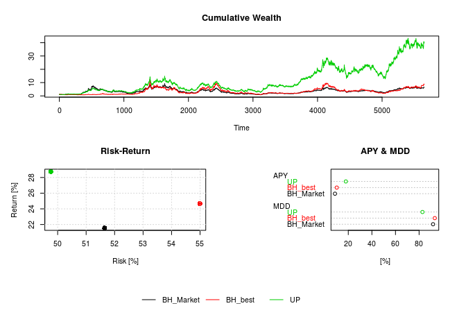

olpsR - On-line Portfolio Selection with R
==========================================

The olpsR package provides different On-line Portfolio Selection algorithms and functions to deal with the on-line portfolio selection problem where a portfolio is rebalanced in every period to achieve certain goals, e.g. maximizing terminal wealth. Datasets to test portfolio selection algorithms are also included.

For a background on On-line Portfolio Selection see for example [Li and Hoi (2014); <http://arxiv.org/pdf/1212.2129.pdf>].

Features
--------

#### On-Line Portfolio Selection algorithms:

-   Buy-and-Hold
-   Buy-and-Hold best
-   Constant Rebalanced Portfolio
-   Best Constant Rebalanced Portfolio
-   Universal Portfolio (Cover 1991)
-   Exponential Gradient (Helmbold et al. 1998)
-   Successive Constant Rebalanced Portfolio (Gaivoronski and Stella 2000)
-   Anticor (Borodin, El-Yaniv, and Gogan 2004)
-   Passive Aggressive Mean Reversion (Li et al. 2012)
-   Confidence Weighted Mean Reversion (Li et al. 2013)
-   Volatility Timing (Kirby and Ostdiek 2012)

#### Functions:

-   transform asset prices into returns (price relatuives)
-   transform returns (price relatuives) into asset prices
-   calculate portfolio wealth of rebalanced portfolios
-   transform a sequence of price relatives into a Kelly market sequence
-   projection onto a simplex
-   ...

#### Datasets:

NYSE, DJIA, SP500, TSE, DAX

Installation
------------

To install the olpsR package run:

``` r
if (!require("devtools")) install.packages("devtools")
devtools::install_github("ngloe/olpsR")
```

Getting started
---------------

Once installed, the package can be loaded using:

``` r
library(olpsR)
```

To test portfolio selection algorithms some return data is loaded using the NYSE dataset. We select two assets, *kinar* and *iroqu*:

``` r
data(NYSE)
x = cbind(kinar=NYSE$kinar, iroqu=NYSE$iroqu)
```

Algorithms can be computed by applying *alg\_ALG* on the selected data where *ALG* is the desired algorithm. For example, to approximate the *Universal Portfolio* algorithm (UP) type:

``` r
UP = alg_UP(x); UP
```

    ## SUMMARY:
    ## --------
    ##   Algorithm   UP 
    ##   Assets      kinar iroqu 
    ## 
    ##   Terminal Wealth   40.54 
    ## 
    ##   Return [%]   28.934              APY [%]   17.948 
    ##   Risk   [%]   50.092              MDD [%]   82.986 
    ## --------

Accessing UP then returns a short summary of the algorithm's output. To access the calculated portfolio wealth or the portfolio weights you can type:

``` r
UP$Wealth
UP$Weights
```

The achieved portfolio wealth (performance) can be plotted by:

``` r
plot(UP)
```

To easily compare different algorithms pass them to the plot function:

``` r
BH_Market = alg_BH( x, weights=c(0.5, 0.5) )
BH_best   = alg_BHbest(x)
plot(BH_Market, BH_best, UP)
```



Getting Help
------------

For more details and an overview of the implemented algorithms and functions please refer to the package help by typing:

``` r
help(package="olpsR")
```

References
----------

Borodin, Allan, Ran El-Yaniv, and Vincent Gogan. 2004. “Can We Learn to Beat the Best Stock.” *Journal of Artificial Intelligence Research* 21 (1). USA: AI Access Foundation: 579–94. <http://www.jair.org/papers/paper1336.html>.

Cover, Thomas M. 1991. “Universal Portfolios.” *Mathematical Finance* 1 (1). Blackwell Publishing Ltd: 1–29. doi:[10.1111/j.1467-9965.1991.tb00002.x](http://dx.doi.org/10.1111/j.1467-9965.1991.tb00002.x).

Gaivoronski, Alexei A., and Fabio Stella. 2000. “Stochastic Nonstationary Optimization for Finding Universal Portfolios.” *Annals of Operations Research* 100 (1-4). Kluwer Academic Publishers: 165–88. doi:[10.1023/A:1019271201970](http://dx.doi.org/10.1023/A:1019271201970).

Helmbold, David P., Robert E. Schapire, Yoram Singer, and Manfred K. Warmuth. 1998. “On-Line Portfolio Selection Using Multiplicative Updates.” *Mathematical Finance* 8 (4). Blackwell Publishers Inc: 325–47. doi:[10.1111/1467-9965.00058](http://dx.doi.org/10.1111/1467-9965.00058).

Kirby, Chris, and Barbara Ostdiek. 2012. “It’s All in the Timing: Simple Active Portfolio Strategies That Outperform Naïve Diversification.” *Journal of Financial and Quantitative Analysis* 47 (02): 437–67. doi:[10.1017/S0022109012000117](http://dx.doi.org/10.1017/S0022109012000117).

Li, Bin, and Steven C. H. Hoi. 2014. “Online Portfolio Selection: A Survey.” *ACM Comput. Surv.* 46 (3). New York, NY, USA: ACM: 35:1–35:36. doi:[10.1145/2512962](http://dx.doi.org/10.1145/2512962).

Li, Bin, Steven C. H. Hoi, Peilin Zhao, and Vivekanand Gopalkrishnan. 2013. “Confidence Weighted Mean Reversion Strategy for Online Portfolio Selection.” *ACM Trans. Knowl. Discov. Data* 7 (1). New York, NY, USA: ACM: 4:1–4:38. doi:[10.1145/2435209.2435213](http://dx.doi.org/10.1145/2435209.2435213).

Li, Bin, Peilin Zhao, Steven C. H. Hoi, and Vivekanand Gopalkrishnan. 2012. “PAMR: Passive Aggressive Mean Reversion Strategy for Portfolio Selection.” *Machine Learning* 87 (2). Springer US: 221–58. doi:[10.1007/s10994-012-5281-z](http://dx.doi.org/10.1007/s10994-012-5281-z).
