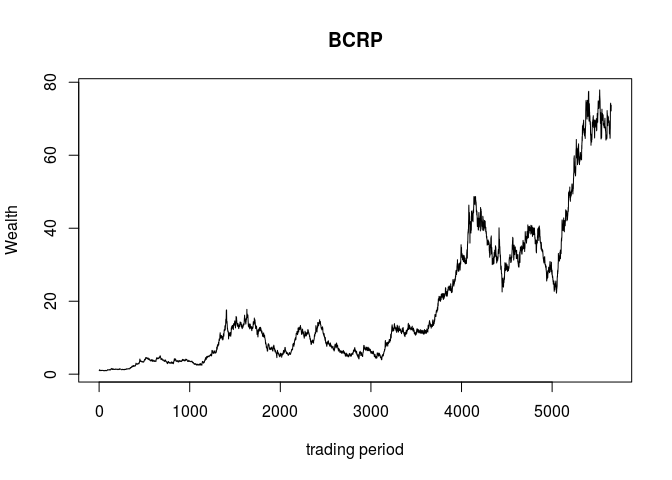

OLPS - On-line Portfolio Selection
==================================

The OLPS package provides different On-line Portfolio Selection algorithms and functions to deal with the on-line portfolio selection problem where a portfolio is rebalanced in every period to achieve certain goals, e.g. maximizing terminal wealth. Datasets to test portfolio selection algorithms are also included.

For a background on On-line Portfolio Selection see for example [Li and Hoi (2014); <http://arxiv.org/pdf/1212.2129.pdf>].

#### On-Line Portfolio Selection algorithms:

-   Buy-and-Hold
-   Buy-and-Hold best
-   Constant Rebalanced Portfolio
-   Best Constant Rebalanced Portfolio
-   Universal Portfolio (Cover 1991)
-   Exponential Gradient (Helmbold et al. 1998)
-   Successive Constant Rebalanced Portfolio (Gaivoronski and Stella 2000)
-   Volatility Timing (Kirby and Ostdiek 2012)

#### Functions

-   transform asset prices into returns (price relatuives)
-   transform returns (price relatuives) into asset prices
-   calculate portfolio wealth of rebalanced portfolios
-   transform a sequence of price relatives into a Kelly market sequence
-   ...

#### Datasets

-   NYSE dataset (used by Cover 1991, Helmbold et al. (1998), ...)
-   DAX dataset

Installation
------------

To install the OLPS package run

``` r
if (!require("devtools")) install.packages("devtools")
devtools::install_github("ngloe/OLPS")
```

Getting started
---------------

Once installed, the package can be loaded in a given R session using:

``` r
library(OLPS)
```

To test portfolio selection algorithms some return data is loaded using the NYSE dataset. We select two assets, *kinar* and *iroqu*:

``` r
data(NYSE)
x <- cbind(kinar=NYSE$kinar, iroqu=NYSE$iroqu)
```

Algorithms can be run by applying *calc\_ALG* on the selected data where *ALG* is the desired algorithm. For example, to calculate the Best Constant Rebalanced Portfolio (BCRP) type:

``` r
BCRP <- calc_BCRP(x)
BCRP
```

    ## SUMMARY of BCRP :
    ## 
    ## Assets                kinar iroqu 
    ## weights               0.4608565 0.5391435 
    ## 
    ## Terminal Wealth       73.70114 
    ## expected log-Return   0.190199 
    ## expected Risk         0.4775194 
    ## Return-to-Risk        0.3983063

Accessing BCRP then returns a short summary of the algorithm's output. To access the calculated portfolio wealth or the portfolio weights you can type:

``` r
BCRPS$Wealth
BCRPS$Weights
```

The achieved portfolio wealth (performance) can be plotted by

``` r
plot(BCRP)
```



References
----------

Cover, Thomas M. 1991. “Universal Portfolios.” *Mathematical Finance* 1 (1). Blackwell Publishing Ltd: 1–29. doi:[10.1111/j.1467-9965.1991.tb00002.x](http://dx.doi.org/10.1111/j.1467-9965.1991.tb00002.x).

Gaivoronski, AlexeiA., and Fabio Stella. 2000. “Stochastic Nonstationary Optimization for Finding Universal Portfolios.” *Annals of Operations Research* 100 (1-4). Kluwer Academic Publishers: 165–88. doi:[10.1023/A:1019271201970](http://dx.doi.org/10.1023/A:1019271201970).

Helmbold, David P., Robert E. Schapire, Yoram Singer, and Manfred K. Warmuth. 1998. “On-Line Portfolio Selection Using Multiplicative Updates.” *Mathematical Finance* 8 (4). Blackwell Publishers Inc: 325–47. doi:[10.1111/1467-9965.00058](http://dx.doi.org/10.1111/1467-9965.00058).

Kirby, Chris, and Barbara Ostdiek. 2012. “It’s All in the Timing: Simple Active Portfolio Strategies That Outperform Naïve Diversification.” *Journal of Financial and Quantitative Analysis* 47 (02): 437–67. doi:[10.1017/S0022109012000117](http://dx.doi.org/10.1017/S0022109012000117).

Li, Bin, and Steven C. H. Hoi. 2014. “Online Portfolio Selection: A Survey.” *ACM Comput. Surv.* 46 (3). New York, NY, USA: ACM: 35:1–35:36. doi:[10.1145/2512962](http://dx.doi.org/10.1145/2512962).
